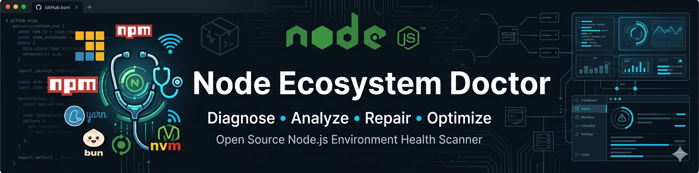

<p align="center">
  
</p>
<style>
  .markdown-body h1.ned {
    margin: -20px 0 16px 0 !important;
    font-weight: 600!important;
    line-height: 1.25!important;
    overflow: hidden!important;
    text-indent: -8000px!important;
    height: 0 !important;
    aling: center;
  }
</style>
<h1 class="ned">🩺 Node Ecosystem Doctor</h1>

<p align="center">
  
  
  
  
</p>

**Node Ecosystem Doctor** é uma ferramenta avançada de diagnóstico, auditoria e otimização para ambientes Node.js, criada para desenvolvedores, profissionais DevOps, SREs e equipes de engenharia de software que buscam garantir ambientes consistentes, atualizados e prontos para produção.

A ferramenta realiza uma análise completa do ecossistema Node.js, validando versões, dependências, gerenciadores de pacotes, conectividade com registries, integridade de cache e configurações críticas do ambiente. Além de identificar inconsistências, gargalos e potenciais problemas operacionais, o Node Ecosystem Doctor fornece recomendações inteligentes e pode executar correções automatizadas para acelerar a resolução de falhas e reduzir o tempo gasto com troubleshooting.

</div>

---

## ✨ Principais Recursos

### 🔍 Diagnóstico Inteligente

Verifica automaticamente:

* Node.js
* NPM
* NVM
* Yarn
* PNPM
* Bun
* Cache NPM
* Conectividade com o Registry
* Compatibilidade com `.nvmrc`
* Compatibilidade com `.node-version`

---

### 🛠 Correção Automatizada

Quando desejado, a ferramenta pode executar correções como:

* Atualização do Node.js
* Instalação do NVM
* Instalação do PNPM
* Instalação do Yarn
* Instalação do Bun
* Reconstrução do Cache NPM
* Limpeza de artefatos obsoletos

---

### 📊 Environment Health Score

Receba uma avaliação visual da saúde do ambiente:

```text
NODE      ████████████████████████████████ 100%
NPM       ██████████████████████████████   98%
NVM       ███████████████████████████      95%
PNPM      ███████████████████              70%

Health Score: 91/100
Status: Environment Excellent 🚀
```

---

### ⚡ Saída para Automação

Ideal para:

* CI/CD Pipelines
* GitHub Actions
* GitLab CI
* Jenkins
* Auditorias internas
* Onboarding de desenvolvedores

Suporte nativo a saída JSON.

---

## 🚀 Instalação

Clone o repositório:

```bash
git clone https://github.com/godoyrw/node-ecosystem-doctor.git
cd node-ecosystem-doctor
```

Conceda permissão de execução:

```bash
chmod +x node-doctor.sh
```

Execute:

```bash
./node-doctor.sh
```

---

## 📖 Utilização

### Diagnóstico Completo

```bash
./node-doctor.sh
```

---

### Correção Automática

```bash
./node-doctor.sh --auto-fix
```

---

### Modo Compacto

```bash
./node-doctor.sh --minimal
```

---

### Saída JSON

```bash
./node-doctor.sh --json
```

---

### Sem Logs

```bash
./node-doctor.sh --no-log
```

---

## 📋 Opções Disponíveis

| Opção        | Descrição                         |
| ------------ | --------------------------------- |
| `--auto-fix` | Executa correções automaticamente |
| `--minimal`  | Saída compacta                    |
| `--json`     | Saída estruturada para automação  |
| `--no-log`   | Não gera arquivos de log          |
| `--help`     | Exibe ajuda                       |

---

## 📦 Exemplo de Saída JSON

```json
{
  "version": "2.0",
  "timestamp": "2026-06-12T15:30:00Z",
  "score": 96,
  "components": {
    "node": {
      "score": 100,
      "version": "v22.17.0",
      "note": "ok"
    },
    "npm": {
      "score": 100,
      "version": "v10.9.3",
      "note": "ok"
    }
  }
}
```

---

## 🎯 Casos de Uso

### 👨‍💻 Desenvolvedores

Validação rápida de ambientes locais.

### ☁️ DevOps

Padronização de workstations e servidores.

### 🏢 Empresas

Auditoria de conformidade de ambientes Node.js.

### 🚀 Startups

Onboarding rápido e consistente para novos membros da equipe.

### 🔐 Times de Segurança

Validação preventiva de versões e componentes críticos.

---

## 🤝 Contribuindo

Contribuições são sempre bem-vindas.

```bash
# Fork
git fork

# Criar branch
git checkout -b feature/nova-feature

# Commit
git commit -m "feat: adiciona nova funcionalidade"

# Push
git push origin feature/nova-feature
```

Depois disso, abra um Pull Request.

---

## 🔒 Segurança

Encontrou uma vulnerabilidade?

Abra uma issue privada ou envie um relatório através do arquivo `SECURITY.md`.

---

## 📄 Licença

Este projeto está licenciado sob a licença MIT.

Consulte o arquivo `LICENSE` para mais informações.

---

<div align="center">

### ⭐ Gostou do projeto?

Considere deixar uma estrela no repositório.

Isso ajuda o projeto a alcançar mais desenvolvedores.

---

**Desenvolvido por Roberto Godoy**

Software Engineer • CTO • Software Architect • DevOps Enthusiast

</div>
